## Olá, o meu nome é Lucas, e eu sou um estudante de programação e desenvolvimento Web!

  <a href="https://github.com/LucasBonato">
  

 

  

  
##
  

  
  
   

  <picture>
    <source media="(prefers-color-scheme: dark)" srcset="https://raw.githubusercontent.com/LucasBonato/LucasBonato/output/github-contribution-grid-snake-dark.svg">
    <source media="(prefers-color-scheme: light)" srcset="https://raw.githubusercontent.com/LucasBonato/LucasBonato/output/github-contribution-grid-snake.svg">
    
  </picture>
  

